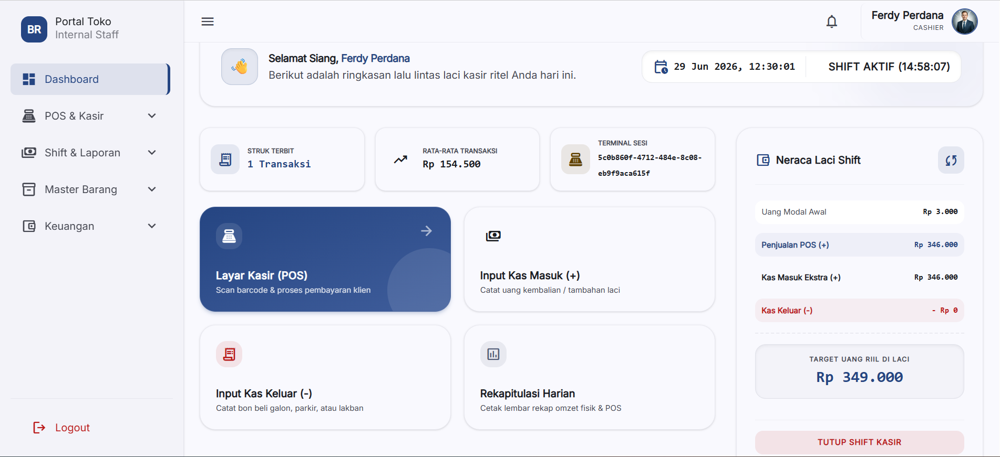
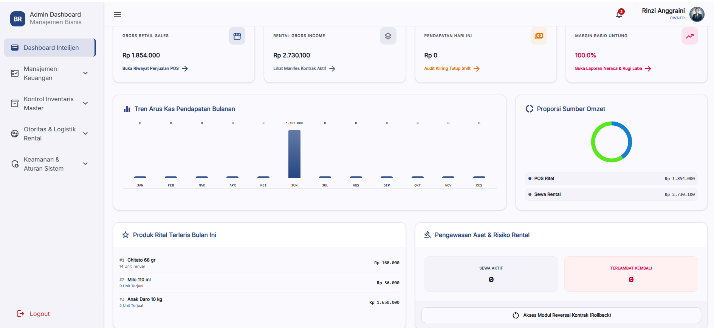
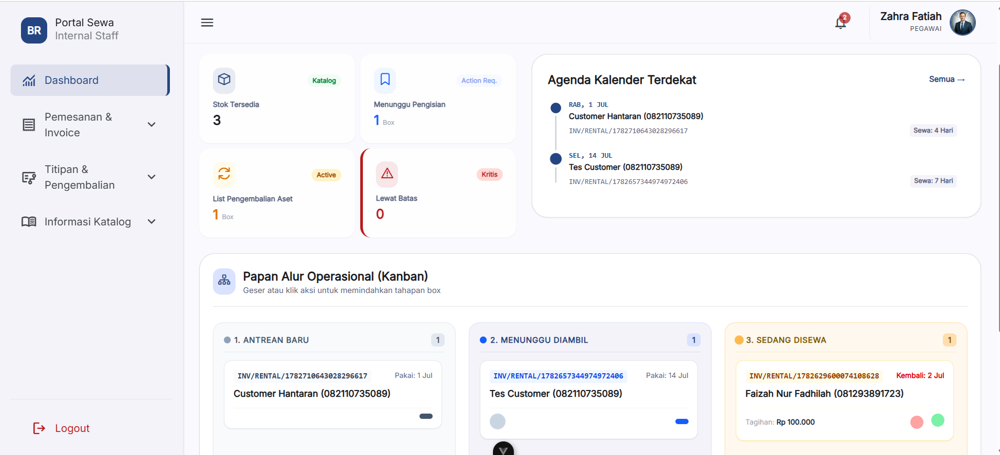

# Bisnis-Rinzi

<p align="center">
  
  
  
  
  
  
  
  
</p>

## Overview

**Bisnis-Rinzi** is a modern business management platform built using a **Microservice Architecture** and **Clean Architecture** principles.

The system is designed to support:

- Inventory Management
- Point of Sale (POS)
- Cash Management
- Rental Management
- Financial Management
- Authentication & Single Sign-On (SSO)

---

# Technology Stack

## Backend

- Go (Golang)
- Clean Architecture
- REST API
- API Gateway
- PostgreSQL
- Redis Streams
- Outbox Pattern
- MinIO Object Storage

## Frontend

- Vue 3
- Vite
- Pinia
- Vue Router
- PrimeVue
- Progressive Web App (PWA)
- IndexedDB Offline Storage

## Infrastructure

- Docker
- Docker Compose
- PostgreSQL
- Redis
- MinIO

---

# System Architecture

```text
                    +------------------+
                    |   API Gateway    |
                    +---------+--------+
                              |
      ---------------------------------------------------
      |          |           |          |          |
      v          v           v          v          v

+-----------+ +-----------+ +--------+ +---------+ +-----------+
|   Auth    | | Inventory | |  POS   | | Rental  | | Finance   |
|  Service  | |  Service  | |Service | | Service | | Service   |
+-----------+ +-----------+ +--------+ +---------+ +-----------+

      |           |           |           |           |
      +-----------+-----------+-----------+-----------+
                              |
                       Redis Streams
                         Event Bus

      -------------------------------------------------
      |               Infrastructure                  |
      -------------------------------------------------

      PostgreSQL (Database per Service)
      Redis Streams
      MinIO Object Storage
```

---

# Portal TOKO



# =====================================

# Admin Dashboard



# =====================================

# Portal Sewa Hantaran



# =====================================

- Internal Gateway

## Microservices

- Auth Service
- Inventory Service
- POS Service
- Rental Service
- Finance Service
- Cash Service

## Auth Service

Responsible for:

- Authentication
- Authorization
- JWT Management
- Single Sign-On (SSO)
- User Management
- Role Management

## Event Driven

- Go outbox_event
